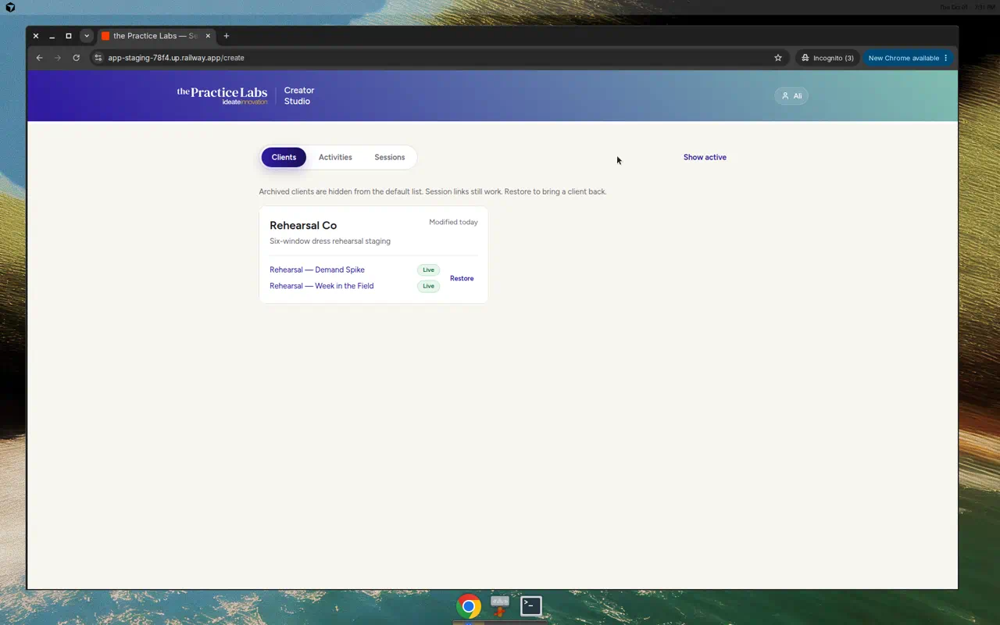
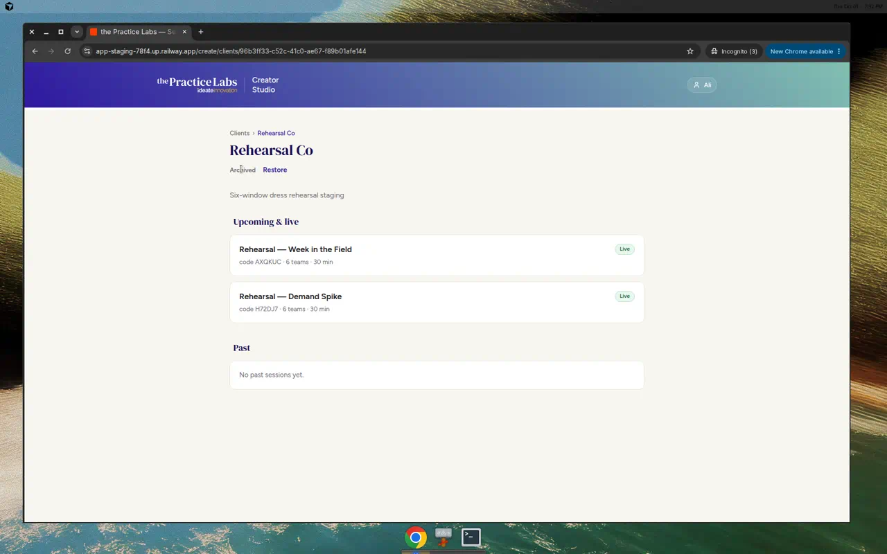
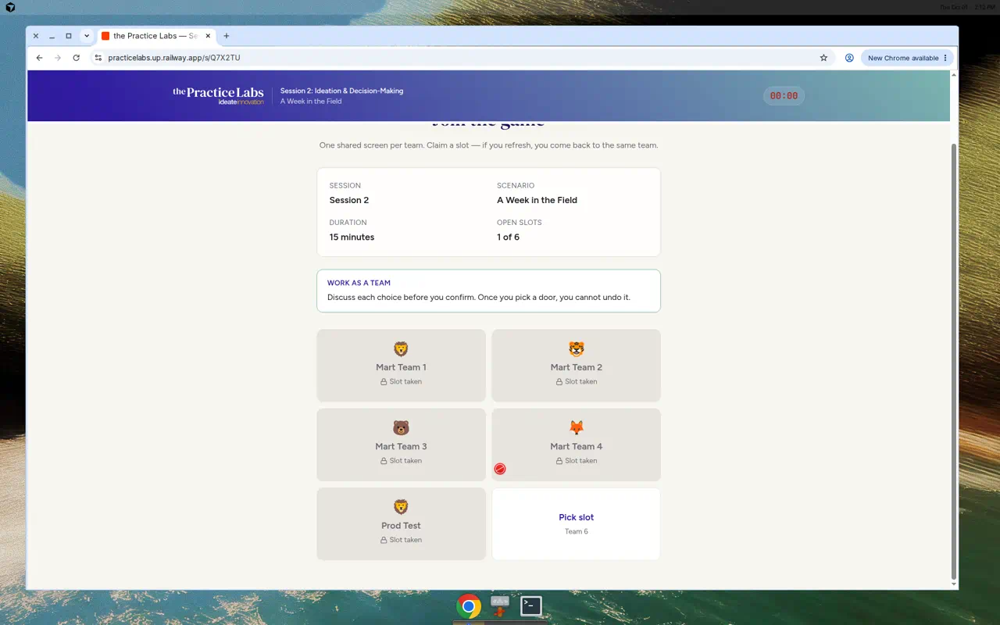
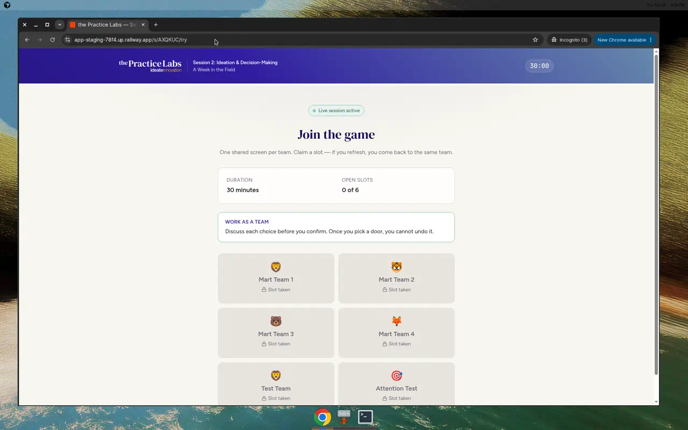

# Practice Labs — build status (2026-10-01)

Audience: planning LLM + Ali.  
Purpose: single source of truth for **what exists now**, how deploy works, what was verified, and what is still open. Supersedes the 2026-09-30 SEM status doc for planning (that file remains historical).

**Code root:** `0406-0305-scenario-simulator-snapshot/`  
**Repo:** `aliatideate/thepracticelabs`

**Screenshots in this doc:** [`./media/status-2026-09-30-sem/`](./media/status-2026-09-30-sem/) · [`./media/status-2026-10-01/`](./media/status-2026-10-01/)  
**Also in agent store:** `docs/practice-labs-status-2026-10-01.md` with fuller media folders.

---

## 1. Snapshot

| | Staging | Production |
| --- | --- | --- |
| URL | https://app-staging-78f4.up.railway.app | https://practicelabs.up.railway.app |
| Git branch | `main` | `production` |
| Tip (as of this doc) | `ca4b217` | `86600ec` (merge of tip-of-main; same app tip including archive) |
| Creator | `/login` → `/create` | same |

**Product intent:** one Ideate operator manages **clients**, picks a **published exercise**, lightly customises tokens (company / chain / locations / logo), creates an **isolated workshop session** (join / facilitate / try / print), and captures **briefs** for exercises still in design. Not an exercise generator.

**Engines:**

| Engine | Player experience | Example exercises |
| --- | --- | --- |
| `investigation` (Demand) | Stakeholder interviews → recommendation | The Demand Spike |
| `branching` (Mart) | Field decisions → reveal / manager review | A Week in the Field; Lacehouse buying week (imported) |

### Deploy rules (standing)

1. Merge to `main` → Railway deploys **staging only**.
2. Promote production only by PR **base=`production`**, **head=`main`** (or tip-of-main promote branch).
3. PR body must list included changes + existing-session impact.
4. Wait for Ali’s explicit **“yes” in chat** before merging the promote PR.
5. **Never** `git push origin production`. **Never** `railway up` production.
6. Docs: repo `docs/deploy-staging-first.md`. Branch protection on `production` is set in GitHub (restrict deletions, block force pushes, require PR, 0 approvals).

---

## 2. What we have built

### 2.1 Creator Studio

Live end-to-end: auth → clients → activities/briefs → new-session wizard → session links → facilitator boards with notes.

| Capability | Notes |
| --- | --- |
| Email/password Creator auth | httpOnly cookie; Railway `CREATOR_*` |
| Clients list + detail | Nested sessions; empty-state boxes |
| New client lightbox | Modal from top |
| Delete empty clients only | Hover trash; blocked if any session exists |
| **Soft-archive clients** | `archived_at`; Archive / Restore; “Show archived”; session links stay live (**#45**, promoted **#46**) |
| Trail breadcrumbs | Clients › … › current |
| Creator-styled selects | Replaced native `<select>` |
| Activities + brief editor | Intake only; no generation |
| Session create | Frozen `resolved_content` + notes per room |
| Co-facilitator `?token=` | Boards load without Creator login |
| Facilitator notes panel | Markdown from resolved notes |
| Shared CSV export prefix | Demand + Mart |

*Creator: new client lightbox.*

*Client with sessions — no delete (archive used instead for clutter).*

*Staging: Show archived — Rehearsal Co with Restore.*

*Client detail while archived — sessions still listed; Restore available.*

### 2.2 Engine contract, import, CSV (PR #33)

| Piece | Status |
| --- | --- |
| Engine contract (progress / board helpers) | Shipped |
| Category ≠ engine in UI | Shipped |
| Shared CSV export | Shipped |
| Exercise import API + CLI + Activities UI | Shipped |
| Token / placeholder safeguards | Shipped |
| Staging-first Railway wiring | Live |

Branching imports **require** a `chrome` block; runtime falls back to Mart defaults for older frozen content.

### 2.3 Mart player chrome in content (PR #34)

Player chrome strings (start CTA, progress “Branch/Stop N of M”, travel overlay, manager-review copy, closing) live in exercise `chrome`. Imports are not stuck on Harbor Mart wording.

Also (2026-10-01): optional `joinTeamKicker` / `joinTeamCallout` on chrome for join-screen coaching (Mart default: door line; Lacehouse: neutral “once you choose…”).

### 2.4 Lacehouse import stress test (PR #35)

Second Mart-engine exercise (Falaj Footwear buying week). Staging import: **zero validation errors**, no code changes. Playthrough OK; board + CSV/JSON OK.

**Caveat:** JSON was written from the Mart v2 template — proves import accepts well-formed branching content; does **not** yet prove a hand-authored exercise gets in without engineering help.

**Still shape-constrained for branching:** option ids `A \| B \| call`; four style keys; hotspot rectangles; travel “comma → area” parsing. Accept until an exercise hits a wall.

### 2.5 Join open-slots fix (PR #36)

Mart join meta used `TEAM_NAMES.length` (10) vs room `teamCount`. Fixed to `teamSlots.length`. Verified staging + production (**N of 6**).

*Production `Q7X2TU`: Open slots **1 of 6** (smoke 2026-10-01).*

### 2.6 Join-screen copy/structure (PR #43)

Within existing join visual language (no redesign):

| Change | Behavior |
| --- | --- |
| Team callout | From exercise `chrome` (Mart default fallback); Demand keeps own line |
| Timer on join | `timerMode="join"` — full duration, neutral; **no red 00:00** when idle/expired |
| MetaGrid | Duration + Open slots only (no Session/Scenario dup with header) |
| Copy | “This **team** already has a slot…” |

*Staging Mart join: timer **30:00** (not red 00:00); MetaGrid Duration + Open slots only.*

### 2.7 Facilitator attention / Ask Moderator (tested + fixed)

| Direction | Mechanism |
| --- | --- |
| Player → facilitator | “Ask Moderator to Join” → `POST …/flag` `{ flagged: true }` |
| Board | Attention pulses red; phone ring on new flag |
| Clear | Click attention → `{ flagged: false }` |
| Facilitator → player “nudge” | **No outbound nudge API** — player blinks locally after asking / while flagged |

**Findings then fix:** Demand clear worked. Mart clear failed on Creator rooms (clear omitted `workshopCode`, API defaulted to `MART` → 404). Fixed: board sends `workshopCode`; flag API loads by session id. On production via promote #44.

### 2.8 Scoring stub `{stops}` (PR #40)

Tag templates use engine-neutral `{stops}`; runtime + import still accept legacy `{branches}`. Mart/Lacehouse content updated. Frozen sessions with `{branches}` keep working.

### 2.9 Soft-archive clients (PR #45 → promote #46)

| | |
| --- | --- |
| Column | `clients.archived_at` |
| Default list | Active only |
| UI | Archive / Restore on card + detail; Show archived toggle |
| Sessions | Links stay live |
| Delete | Unchanged (empty clients only) |

Verified on staging with Creator login (Rehearsal Co archive → restore). Live on production after #46.

---

## 3. Rehearsals / verification log

| When | Env | What | Outcome |
| --- | --- | --- | --- |
| 2026-09-30 | Staging | Creator rehearsal (7 teams) | Mid-flow refresh, CSV, archive save, print OK; co-fac token fixed |
| 2026-09-30 | Production | Creator rehearsal | Same shape @ earlier tip |
| 2026-10-01 | Production | Smoke after #36 | Open slots 1 of 6; co-fac boards; Demand + Mart happy paths |
| 2026-10-01 | Staging | Attention | Demand OK; Mart clear bug found → fixed in #43 |
| 2026-10-01 | Staging | Join fixes | Timer + MetaGrid verified |
| 2026-10-01 | Staging | Archive UI | Archive / Show archived / Restore pass |
| 2026-10-01 | Production | Promote #44 then #46 | Join/attention/`{stops}` then archive live |

Handy rooms:

| | Staging | Production |
| --- | --- | --- |
| Mart | `/s/AXQKUC` | `/s/Q7X2TU` |
| Demand | `/s/H72DJ7` | `/s/6SZHRJ` |
| Lacehouse try | `/s/HD6Y2S/try` | — |
| Creator | `/login` | `/login` |

---

## 4. What is left / lower urgency

| Item | Priority | Notes |
| --- | --- | --- |
| Join **visual** redesign | Blocked / not must-have | Ali said reuse existing join visual language; copy/structure done. Full redesign still waits on further design input if wanted |
| Device-switch reclaim | Report only | Resume = browser `localStorage`; new device → facilitator **Release** (progress lost). No magic-link reclaim |
| Formal six-window dress rehearsal | Medium | Multi-team + mid-flow already done; timed 30‑min pass optional (prefer staging) |
| Save `/print` as PDF | Low/ops | Demand print HTML works; manual PDF fallback |
| Loosen Mart engine shape | Only if needed | Accept until an exercise hits constraints |
| Hand-authored import proof | Medium | Lacehouse was Mart-template-derived |
| Roles / audit / multi-org | Not blocking | One-operator tool |
| Unilever Session 1 content | Locked | Do not reopen |

Content locked: Rohini Q3 events-only, SKU snapshot decisions, etc. Do not restore removed demo screens.

---

## 5. Recent PRs (2026-09-30 → 2026-10-01)

| PR | Topic | Prod? |
| --- | --- | --- |
| [#33](https://github.com/aliatideate/thepracticelabs/pull/33) | Engine contract, import, CSV | yes (earlier) |
| [#34](https://github.com/aliatideate/thepracticelabs/pull/34) | Mart chrome → content | yes |
| [#35](https://github.com/aliatideate/thepracticelabs/pull/35) | Lacehouse import content | yes |
| [#36](https://github.com/aliatideate/thepracticelabs/pull/36) | Open-slots = teamCount | yes |
| [#37](https://github.com/aliatideate/thepracticelabs/pull/37) | SEM status doc | yes (via #44) |
| [#38](https://github.com/aliatideate/thepracticelabs/pull/38) | Continue-build handoff | yes |
| [#40](https://github.com/aliatideate/thepracticelabs/pull/40) | `{stops}` + archive proposal | yes |
| [#41](https://github.com/aliatideate/thepracticelabs/pull/41) | Promote-via-PR rule | yes |
| [#42](https://github.com/aliatideate/thepracticelabs/pull/42) | Join plan docs | yes |
| [#43](https://github.com/aliatideate/thepracticelabs/pull/43) | Join fixes + Mart attention clear | yes (#44) |
| [#44](https://github.com/aliatideate/thepracticelabs/pull/44) | Promote main→production (through #43) | — |
| [#45](https://github.com/aliatideate/thepracticelabs/pull/45) | Soft-archive clients | yes (#46) |
| [#46](https://github.com/aliatideate/thepracticelabs/pull/46) | Promote archive to production | — |

---

## 6. Decisions locked (Ali)

| Topic | Decision |
| --- | --- |
| Deploy | Staging-first; promote = PR `main`→`production` + chat yes; never push `production` |
| Branch protection | On `production`: no force-push/delete, require PR, 0 approvals |
| Mart shape | Accept until an exercise hits a constraint |
| Join visual polish | Not a pre-workshop must-have; reuse existing join language |
| Attention | High priority; exercised + Mart clear fixed |
| Archive | Soft `archivedAt`; links stay live; client-level only |
| Roles / audit / multi-org | Do not block while one-operator |

---

## 7. Related docs

| Doc | Role |
| --- | --- |
| `docs/deploy-staging-first.md` | Deploy rules |
| `docs/import-and-safeguards.md` | Import validation |
| `docs/rehearsal-results.md` | Rehearsal log |
| `docs/join-screen-fixes-plan-2026-10-01.md` | Join plan (implemented) |
| `docs/archive-hide-clients-proposal-2026-10-01.md` | Archive (now implemented) |
| `docs/handoff-2026-10-01-continue-build.md` | Ordered build handoff (completed) |
| Agent store `internal/` | Smoke/attention/promote notes |

---

## 8. Suggested questions for the planning LLM

1. Given archive + join + attention are live on prod, what is the highest-value next product investment (hand-authored import proof vs six-window rehearsal vs device reclaim vs Creator polish)?
2. Should device-switch reclaim (magic link / code) be designed now, or accept Release-and-lose-progress for v1 workshops?
3. Any workshop-day checklist gaps beyond attention (now verified) and `/print` PDF?
4. When should the next imported exercise be tried **outside** the Mart v2 template?
