# Practice Labs — build status for review (2026-09-30)

Audience: senior engineering manager + LLM reviewers.  
Ask for: comments on product completeness, risk, and what still needs attention to get the tool into **good overall shape** (not gated on a single upcoming workshop date).

**Screenshots in this doc:** [`./media/status-2026-09-30-sem/`](./media/status-2026-09-30-sem/)  
**Code root:** `0406-0305-scenario-simulator-snapshot/` · Repo: `aliatideate/thepracticelabs`

---

## 1. Snapshot

| | Staging | Production |
| --- | --- | --- |
| URL | https://app-staging-78f4.up.railway.app | https://practicelabs.up.railway.app |
| Git branch | `main` | `production` |
| Tip (as of this doc) | `f74aaf2` (includes open-slots fix) | `f74aaf2` (same — #36 promoted 2026-10-01) |
| Creator | `/login` → `/create` | same |

**Deploy model (hard rule):** merge → staging only. Production updates only via a PR from `main` into `production`, after Ali’s explicit “yes” in chat. Never push `production` directly. No `railway up` to production. Details: repo `docs/deploy-staging-first.md`.

**Product intent:** one Ideate operator manages **clients**, picks a **published exercise**, lightly customises tokens (company / chain / locations / logo), creates an **isolated workshop session** (join / facilitate / try / print), and captures **briefs** for exercises still in design. Not an exercise generator.

**Engines today:**

| Engine | Player experience | Example exercise |
| --- | --- | --- |
| `investigation` (Demand) | Stakeholder interviews → recommendation | The Demand Spike |
| `branching` (Mart) | Field decisions → reveal / manager review | A Week in the Field; Lacehouse buying week (imported) |

---

## 2. What we have built

### 2.1 Creator Studio (Phases 1–5 + 7)

Live end-to-end: auth → clients → activities/briefs → new-session wizard → session links → facilitator boards with notes.

| Capability | Notes |
| --- | --- |
| Email/password Creator auth | httpOnly cookie; Railway `CREATOR_*` |
| Clients list + detail | Nested sessions; empty-state boxes |
| New client lightbox | Modal drifts from top |
| Delete empty clients only | Hover trash on card; blocked if any session exists |
| Amazon-style trail breadcrumbs | Clients › … › current |
| Creator-styled selects | Replaced native `<select>` |
| Activities + brief editor | Intake only; no generation |
| Session create | Frozen `resolved_content` + notes per room |
| Co-facilitator `?token=` links | Board loads without Creator login (fixed 2026-09-30) |
| Facilitator notes panel | Markdown from resolved notes (Phase 7) |
| Shared CSV export prefix | Demand + Mart |

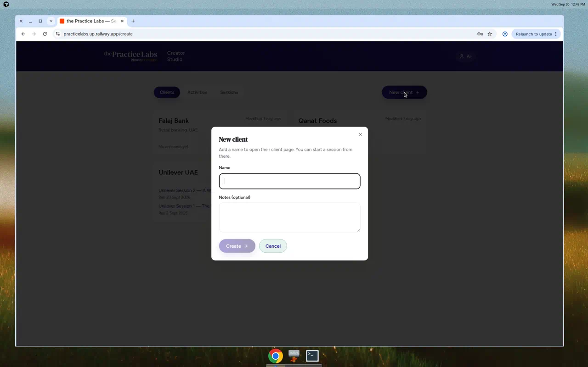

*New client lightbox on Creator home.*

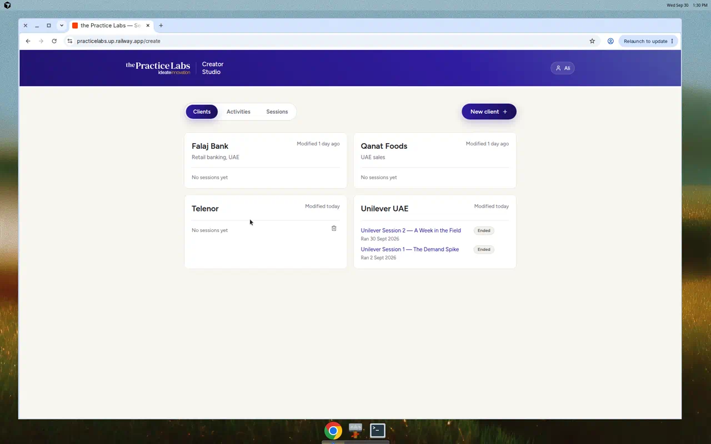

*Empty client: trash appears on hover → confirm delete.*

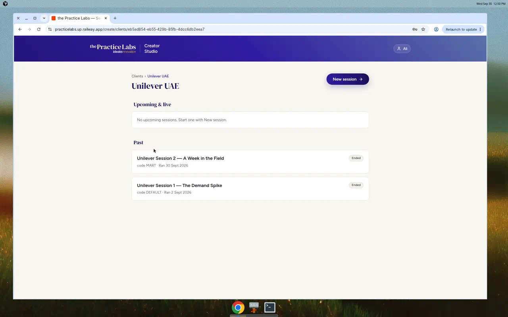

*Client with sessions: no delete control; status tags flush right.*

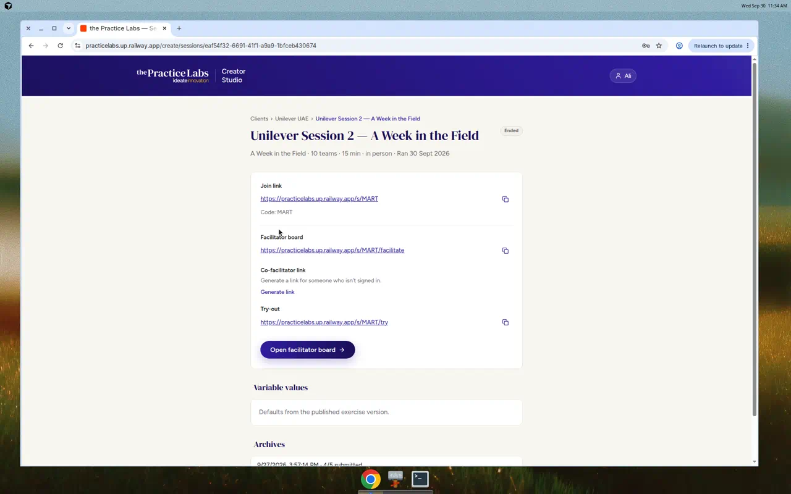

*Session detail trail: Clients › client › session title.*

### 2.2 Rest-of-build (PR #33) — engine contract, import, CSV

| Piece | Status |
| --- | --- |
| Engine contract (progress / board helpers) | Shipped |
| Category ≠ engine in UI | Shipped (wizard/Activities no longer conflate them) |
| Shared CSV export | Shipped |
| Exercise import API + CLI + Activities UI | Shipped |
| Token / placeholder safeguards on import + session create | Shipped |
| Staging-first Railway wiring | Live |

Import entry points: `POST /api/create/exercises/import`, `pnpm import:exercise`, Activities → Import. Branching imports **require** a `chrome` block (player UI strings); runtime falls back to Mart defaults for older frozen content.

### 2.3 Mart player chrome in content (PR #34)

Player chrome strings (e.g. “Start the week”, progress “Branch N of M”, travel overlay, manager-review copy, closing line) lift into exercise `chrome` so imported stories are not stuck on Harbor Mart wording.

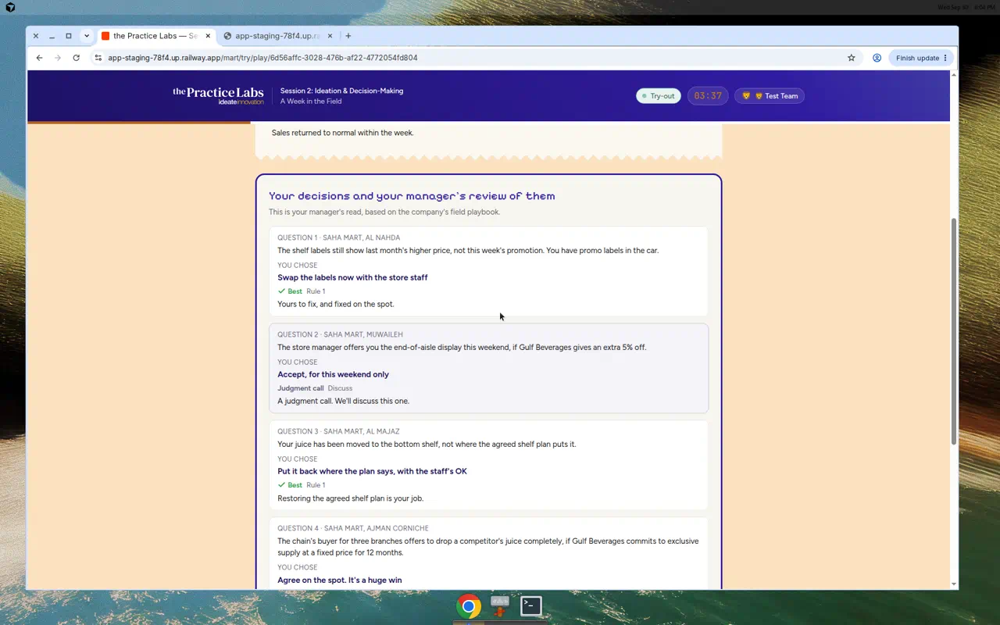

*Reveal manager-review block — wording can come from content `chrome`.*

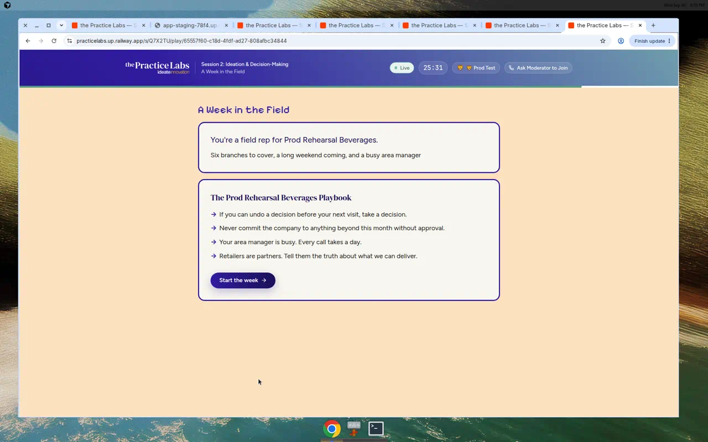

*Production Mart try-out intro (Harbor Mart / Week in the Field).*

### 2.4 Lacehouse import stress test (PR #35 + staging import)

Real second Mart-engine exercise (not a schema fixture): Falaj Footwear buying week. Imported on **staging** with **zero validation errors** and **no code changes**.

| | |
| --- | --- |
| Client | Falaj Footwear |
| Code | `HD6Y2S` |
| Own variables | `company.name`, `influencer.name`, `locations.*` (not `branches.*`) |
| Playthrough | Intro → 6 stops → reveal; board + CSV/JSON export OK |

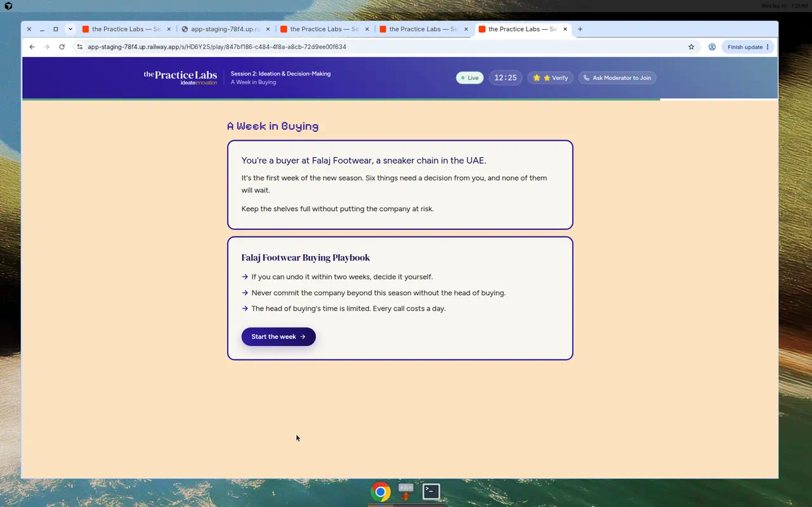

*Imported Lacehouse intro — chrome “Start the week” on a non-Mart story.*

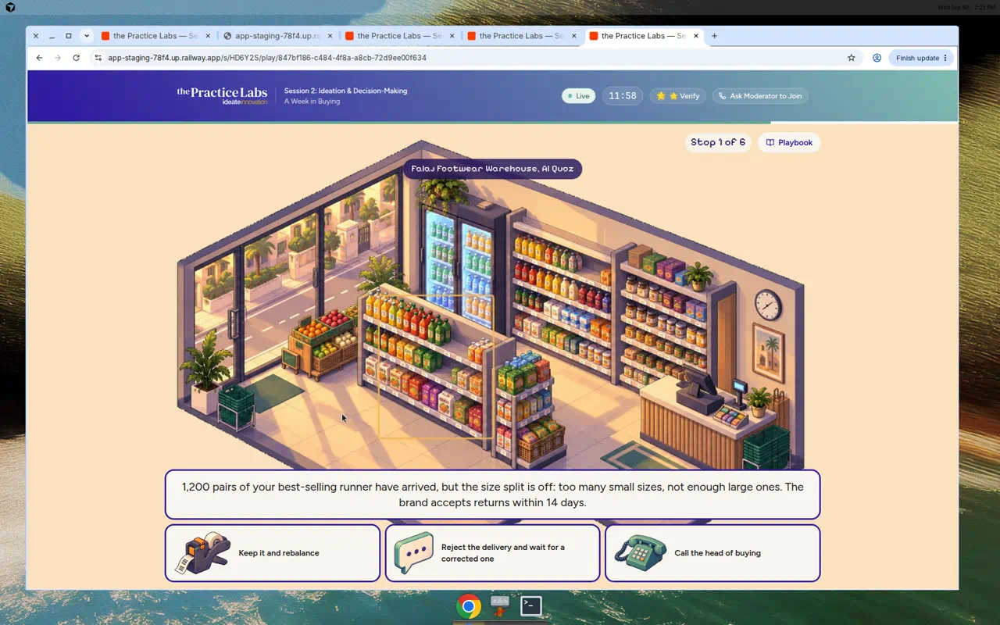

*Stop 1 of 6 at Al Quoz — progress chrome + location tokens resolved.*

**Caveat:** import passed cleanly, but the Lacehouse JSON was **written from the Mart v2 template**. That proves the import path accepts well-formed branching content; it does **not** yet prove a hand-authored exercise (authored outside the Mart template) gets in without engineering help.

**Still hardcoded for any branching story** (by design today): option ids `A \| B \| call`; four style keys (`operator|escalator|cowboy|bottleneck`); `{branches}` token name inside some tag templates; hotspot rectangles; travel “comma → area” parsing. Labels/copy can change; shape cannot without more engine work.

### 2.5 Join open-slots fix (PR #36) — staging + production

Mart join meta used `TEAM_NAMES.length` (10) while the grid used `room.teamCount` (e.g. 6). Fixed to `teamSlots.length`.

| Env | Room | Observed |
| --- | --- | --- |
| Staging | `AXQKUC` | **1 of 6** (verified earlier) |
| Production | `Q7X2TU` | **1 of 6** after promote + smoke 2026-10-01 |

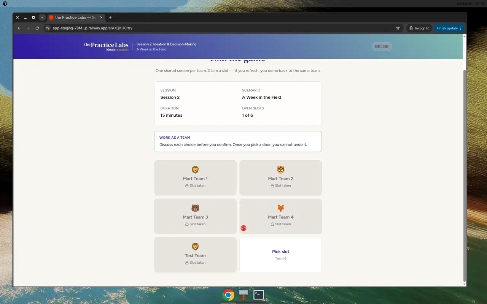

*Staging Mart join after #36: Open slots **1 of 6**, six cards — matches room `teamCount`.*

### 2.6 Rehearsals already run

| Env | When | Client | Sessions | Outcome |
| --- | --- | --- | --- | --- |
| Staging | 2026-09-30 | Rehearsal Co | Demand `H72DJ7`, Mart `AXQKUC` | 7 team joins; mid-flow refresh OK; CSV/archive/print OK |
| Production | 2026-09-30 | Prod Rehearsal Co | Demand `6SZHRJ`, Mart `Q7X2TU` | Same shape; promote OK at tip `5a2e218`+ |
| Production | 2026-10-01 | Prod Rehearsal Co (smoke) | same codes | After #36 FF: open-slots **1 of 6**; co-fac `?token=` boards; Demand + Mart happy paths — all pass |

**Broke then fixed:** co-facilitator UI links hit Creator `/login` because `AuthGate` ignored `?token=`. Fix: `allowFacilitatorToken` on facilitate routes. Retested staging + production.

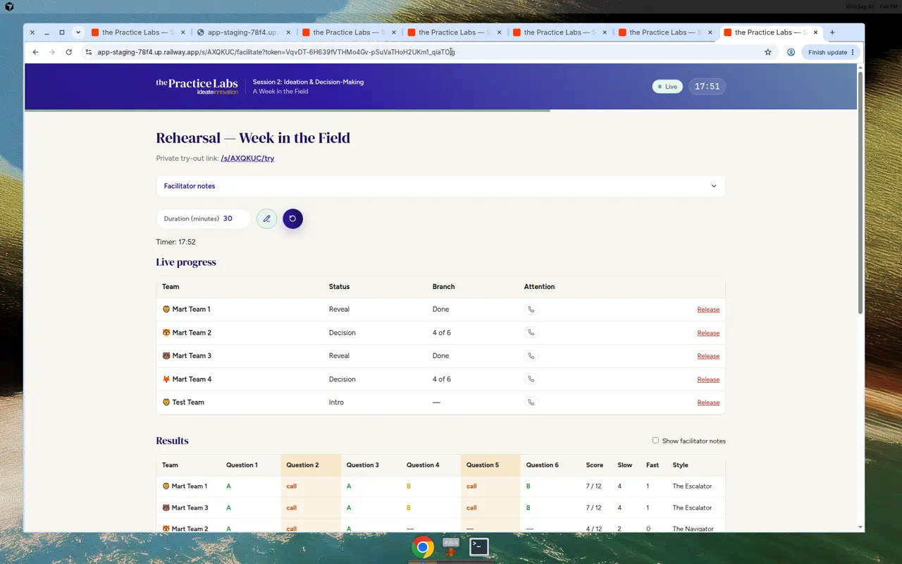

*Mart board via co-facilitator token (no Creator login).*

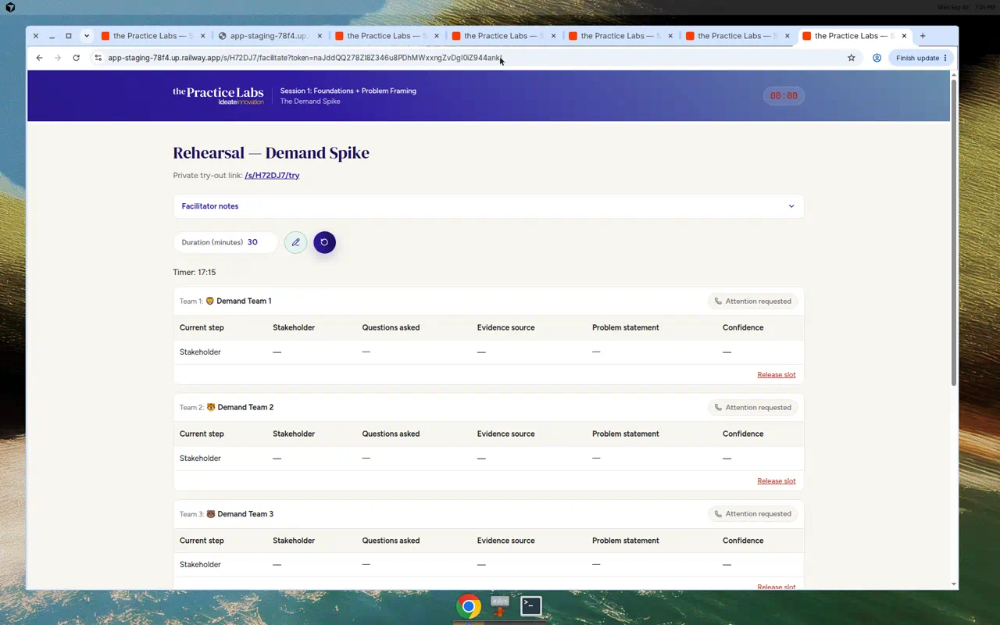

*Demand board via co-facilitator token.*

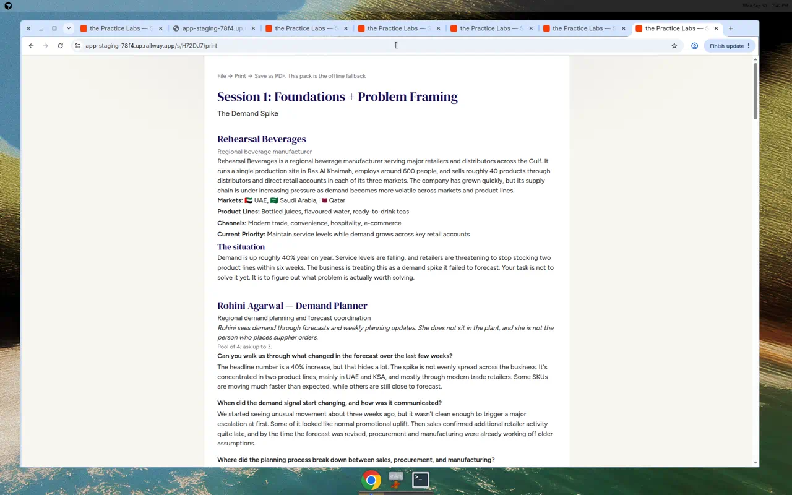

*Demand `/print` HTML with client-renamed company (breakout PDF fallback).*

---

## 3. What is left

| Item | Priority | Notes |
| --- | --- | --- |
| **Facilitator attention / nudge** | **High** | Built earlier; **never exercised** in rehearsals — exercise on staging before trusting |
| **Join-flow visual polish** | Blocked / not must-have | Waiting on Ali’s examples; do **not** invent a redesign. Not a pre-workshop blocker. |
| **Join copy/structure fixes** | Plan first | Team callout → chrome; timer red 00:00 before start; duplicate session/scenario; “table”→“team”; device-switch report |
| **`{branches}` → engine-neutral token** | Medium | e.g. `{stops}` with fallback for existing content |
| **Six-window dress rehearsal (formal)** | Medium | Multi-team + mid-flow refresh done; timed 30‑min six-window pass may still be desired (prefer staging) |
| **Save `/print` as PDF** | Low/ops | Process fallback for breakouts; Demand print HTML already works |
| **Loosen Mart engine shape** | Only if needed | Accept current constraints until an exercise actually hits one |
| **Branch protection on `production`** | Ops (Ali click) | Keep staging-first; see §7 for exact GitHub clicks |
| **Archive / hide clients** | Proposal only | Prod clients with sessions can’t be deleted — clutter from rehearsals |
| **Unilever Session 1 content** | Locked | Do not reopen decided content (Rohini Q3, SKU snapshot, etc.) |

Out of scope unless reopened: restoring removed demo screens; rewriting live Unilever pedagogy. Roles, audit log, and multi-org do **not** block while this is a one-operator tool.

---

## 4. What matters most to test next

Prefer **staging** for new rehearsal (prod clients can’t be deleted when sessions exist). Ordered for getting the tool into good overall shape.

### P0 — confidence on current tip

1. **Attention / nudge** on staging Mart + Demand boards (never rehearsed) — report before fixing.
2. **Mart join open slots** (already green on staging + prod) — https://app-staging-78f4.up.railway.app/s/AXQKUC · https://practicelabs.up.railway.app/s/Q7X2TU  
   Expect Open slots **N of 6** (not 10); card count = `teamCount`.
3. **Co-facilitator token** — session’s co-facilitator link (incognito). Board without Creator login (Mart + Demand). Verified again on prod 2026-10-01.

### P1 — import / multi-exercise confidence

4. **Lacehouse imported session** — https://app-staging-78f4.up.railway.app/s/HD6Y2S/try  
   Chrome (“Stop N of M”, “Next stop”), renamed locations, full path to reveal.
5. **Import UI or CLI** — Activities → Import (or CLI) with a rough hand-authored third exercise if available; fail-closed validation should surface path errors, not write bad rows.
6. **CSV + archive** — after ≥1 team submits, export CSV (shared prefix) and save/list archive on both engines.

### P2 — ops / polish

7. **Demand `/print`** — https://app-staging-78f4.up.railway.app/s/H72DJ7/print (or fresh session); save PDF manually if needed for breakouts.
8. **Join copy/structure** after Ali approves the plan (not the blocked visual redesign).
9. **Further production smoke** — only when Ali says so for the next promote beyond #36.

### Explicitly lower urgency

- Join visual redesign (blocked on design input; not a must-have).  
- Engine shape generalisation (only if next imported exercise hits a wall).  
- Creator UI chrome polish already shipped (#28–#32).  
- Roles / audit log / multi-org (one-operator tool).

---

## 5. Handy links

### Staging

| Purpose | URL |
| --- | --- |
| Creator | https://app-staging-78f4.up.railway.app/login |
| Mart rehearsal join | https://app-staging-78f4.up.railway.app/s/AXQKUC |
| Demand rehearsal join | https://app-staging-78f4.up.railway.app/s/H72DJ7 |
| Demand print | https://app-staging-78f4.up.railway.app/s/H72DJ7/print |
| Lacehouse try | https://app-staging-78f4.up.railway.app/s/HD6Y2S/try |
| Lacehouse facilitate | https://app-staging-78f4.up.railway.app/s/HD6Y2S/facilitate |

### Production

| Purpose | URL |
| --- | --- |
| Creator | https://practicelabs.up.railway.app/login |
| Mart rehearsal | https://practicelabs.up.railway.app/s/Q7X2TU |
| Demand rehearsal | https://practicelabs.up.railway.app/s/6SZHRJ |
| Legacy Unilever facilitate | https://practicelabs.up.railway.app/facilitate/unilever-s1 |

---

## 6. Recent merged PRs (context)

| PR | Topic |
| --- | --- |
| [#33](https://github.com/aliatideate/thepracticelabs/pull/33) | Rest of Creator build: engine contract, import, shared CSV |
| [#34](https://github.com/aliatideate/thepracticelabs/pull/34) | Mart player chrome → content |
| [#35](https://github.com/aliatideate/thepracticelabs/pull/35) | Lacehouse Mart-engine import stress-test content |
| [#36](https://github.com/aliatideate/thepracticelabs/pull/36) | Mart join open-slots count = `teamCount` (**promoted to production** 2026-10-01 @ `f74aaf2`) |
| #28–#32 | Creator breadcrumbs, selects, client lightbox/delete |

---

## 7. Decisions (Ali) + GitHub clicks

### Deploy / branch protection

**Keep staging-first.** Add branch protection on `production`: block force pushes + deletion, require a pull request, **no** approval requirement.

**Exact clicks (GitHub):**

1. Open https://github.com/aliatideate/thepracticelabs/settings/rules  
   (or **Settings → Rules → Rulesets**).
2. **New ruleset** → name e.g. `protect-production`.
3. **Enforcement status:** Active.
4. **Target branches → Add target → Include by pattern** → `production`.
5. Under **Rules**:
   - Turn **on** Restrict deletions.
   - Turn **on** Block force pushes.
   - Turn **on** Require a pull request before merging.
   - Set **Required approvals** to **0** (do **not** require reviewers).
   - Leave status checks / CODEOWNERS / linear history off unless you want them later.
6. **Create** / Save.

(If the repo still shows classic **Settings → Branches → Branch protection rules**, same intent: rule for `production`, require PR before merging with approvals unchecked/0, disallow force pushes, disallow deletions.)

**Promote process:** open a PR **base=`production`**, **head=`main`**; in the body list included changes and anything that could affect existing sessions; wait for Ali’s explicit “yes” in chat; merge that PR. **Never** `git push origin production`. Never `railway up` production. Nothing beyond #36 goes to production without Ali’s explicit OK.

### Product scope answers

| Topic | Decision |
| --- | --- |
| Mart shape constraints | **Accept** until an exercise actually hits one |
| Join visual polish | **Not** a pre-workshop must-have; wait for Ali examples |
| Attention / nudge | Raise priority (**High**); exercise on staging soon |
| Roles / audit log / multi-org | Do **not** block while this is a one-operator tool |

---

## 8. Related docs (deeper / agent-oriented)

| Doc | Role |
| --- | --- |
| `docs/deploy-staging-first.md` | Deploy rules |
| `docs/import-and-safeguards.md` | Import validation |
| `docs/rehearsal-results.md` | Staging + prod rehearsal log |
| `docs/shell-engine-audit.md` | Shell vs engine boundary |
| `docs/creator-studio-status-2026-09-30.md` | Earlier Creator UI handoff (partly superseded) |
| `docs/handoff-2026-09-30.md` | Agent pick-up + Mart content-vs-code notes |
| `docs/handoff-2026-10-01-continue-build.md` | Continue-build ordered list (PR #38) |
